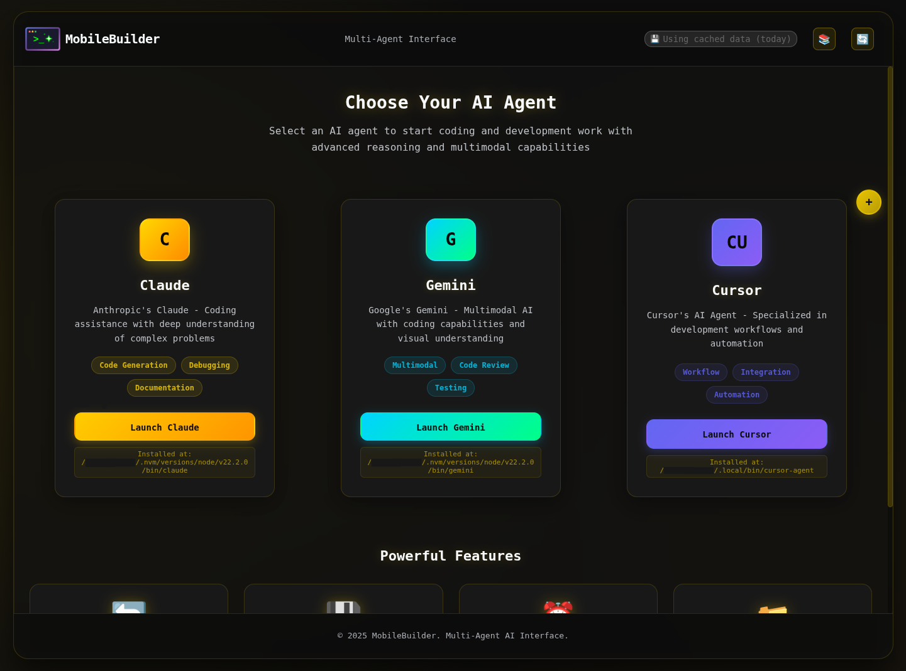
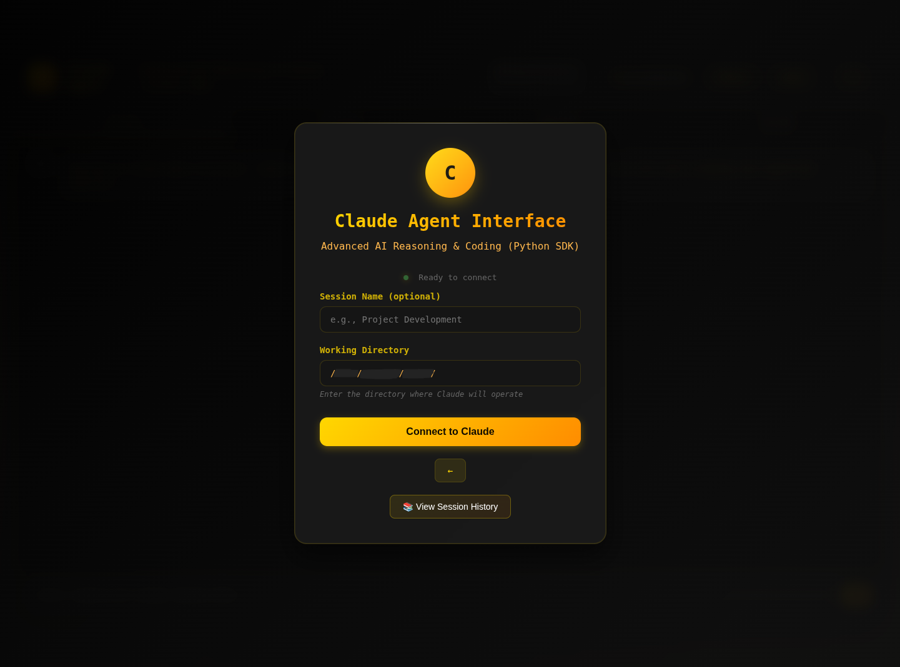
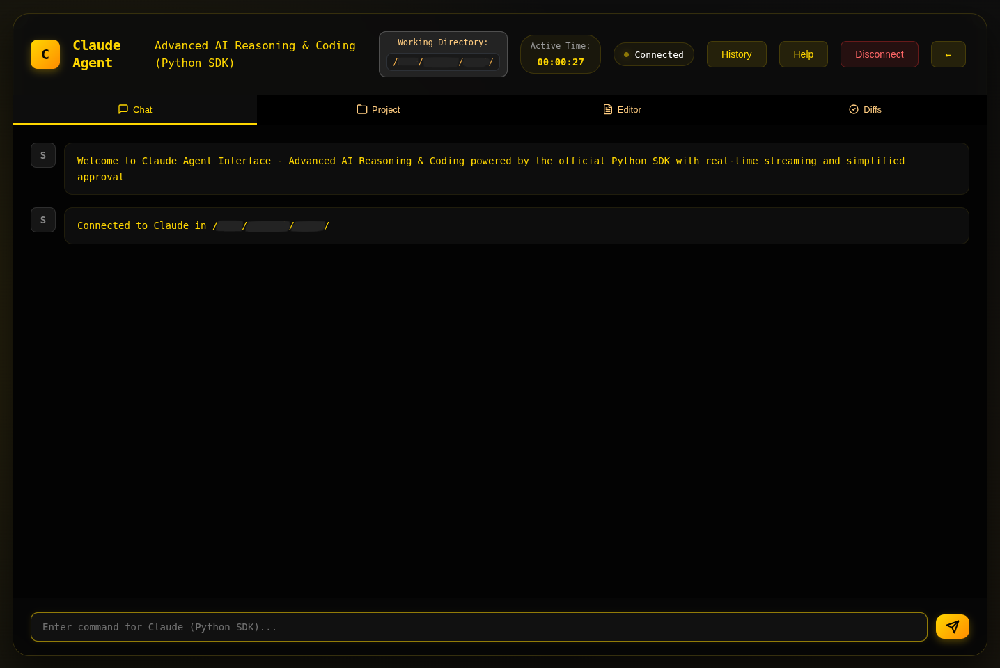

# MobileBuilder - Multi-Agent AI Interface

**Release Version:** Alpha v0.1.0a-091025  
⚠️ **This is an early alpha release and may contain many UI bugs and other issues. We encourage you to download, test, find bugs, and help us improve it!**

## 📸 Screenshots

<div align="center">
  
  
  
</div>

*Main Interface | Connection Screen | Agent Chat*

A comprehensive multi-agent AI interface that supports Claude, Gemini, Cursor, and Codex command line agents with advanced streaming and session history, PWA install capabilities, Cross-device Sessions, PWA app interface scaling, and session resume (some agents).

## 🤝 Help Us Build This!

This project is in active development and we need your help! Please:
- **Download and test** the app on different devices
- **Report bugs** by opening GitHub issues
- **Submit pull requests** with fixes and improvements
- **Contribute new features** - agent integrations, UI improvements, mobile optimizations
- **Share feedback** on what works and what doesn't

Every contribution helps make MobileBuilder better for the community!

## 🚀 Features

- **Multi-Agent Support**: Switch between Claude, Gemini, Cursor, and Codex agents
- **PWA (Progressive Web App)**: Install as a native app on mobile devices after setting up HTTPS
- **Mobile Scaling**: Adaptive interface scaling for mobile devices (50%-100%) in PWA mode
- **Real-time Streaming**: Live streaming of AI agent responses and session history
- **Multi-turn Conversations**: Seamless conversation continuity with context preservation
- **Tool Integration**: Built-in support for file operations, code execution, and more
- **Permission Handling**: Smart approval system for tool usage via MCP in Claude Code
- **HTTPS Support**: Secure connections with mkcert integration (and mobile device cert approval)
- **Session Management**: Persistent session history with database storage
- **Multi-Device Sync**: Connect from multiple devices and stay synchronized, move from computer to phone
- **File Watching**: Real-time file change detection and diff management (in development)
- **Responsive Design**: Modern, themeable UI for each agent that works on all devices

## 🏗️ Project Structure

```
MobileBuilder/
├── app.py                      # Main Flask application
├── agents/                     # Agent implementations
│   ├── generic_agent.py        # Core agent functionality
│   ├── claude_code.py          # Claude agent wrapper
│   ├── gemini_cli.py           # Gemini agent wrapper
│   ├── cursor_agent.py         # Cursor agent wrapper
│   ├── codex_cli.py            # Codex agent wrapper
│   ├── approve_tools.py        # MCP approval server
│   ├── db_manager.py           # Database management
│   ├── file_watcher.py         # File change detection
│   └── mcp-servers.json        # MCP server configuration
├── static/                     # Web assets
│   ├── css/                    # Stylesheets
│   ├── js/                     # JavaScript modules
│   ├── images/                 # Icons and images
│   ├── manifest.json           # PWA manifest
│   ├── sw.js                   # Service worker
│   └── offline.html            # Offline page
├── templates/                  # HTML templates
├── app.py                      # Main app server to run
├── requirements.txt            # Python dependencies
└── README.md                   # This file
```

## 🔧 Installation

### 1. Clone and Setup

```bash
git clone <repository-url>
cd MobileBuilder
python3 -m venv venv
source venv/bin/activate  # On Windows: venv\Scripts\activate
pip install -r requirements.txt
```

### 2. Install AI Agents

**Claude (Required for full functionality):**
```bash
npm install -g @anthropic-ai/claude-code
```

**Optional Agents:**
```bash
# Gemini
# Follow: https://github.com/google-gemini/gemini-cli

# Cursor
# Follow: https://cursor.com/cli

# Codex
# Follow: https://developers.openai.com/codex/cli/
```

### 3. System Dependencies

```bash
# Ubuntu/Debian
sudo apt-get install python3-dev

# CentOS/RHEL
sudo yum install python3-devel
```

## 🔐 HTTPS Setup with mkcert

### 1. Install mkcert

```bash
# macOS
brew install mkcert

# Ubuntu/Debian
sudo apt install libnss3-tools
wget -O mkcert https://github.com/FiloSottile/mkcert/releases/download/v1.4.4/mkcert-v1.4.4-linux-amd64
chmod +x mkcert
sudo mv mkcert /usr/local/bin/

# Windows
choco install mkcert
```

### 2. Install CA Root Certificate

```bash
# Install local CA
mkcert -install
```

### 3. Generate Certificates

```bash
# Replace 'my-computer.local' with your actual hostname
mkcert my-computer.local localhost 127.0.0.1 ::1

# This creates:
# - my-computer.local+4-cert.pem
# - my-computer.local+4-key.pem
```

### 4. Configure Environment

Create a `.env` file:
```bash
# .env
LOCAL_HOSTNAME=my-computer.local
DEFAULT_WORKING_DIR=/path/to/your/projects
MAIN_APP_URL=https://my-computer.local:10000
PORT=10000
```

### 5. Install CA on Mobile Devices

**For PWA to work on mobile devices, install the CA root certificate:**

**Android:**
1. Download the root certificate: `mkcert -CAROOT` (shows path)
2. Copy `rootCA.pem` to your phone
3. Settings → Security → Install certificates → CA certificate
4. Select the downloaded file

**iOS:**
1. Download the root certificate to your phone
2. Settings → General → VPN & Device Management
3. Install the profile
4. Settings → General → About → Certificate Trust Settings
5. Enable full trust for the certificate

## 📱 PWA Installation

### Desktop (Chrome/Edge)
1. Visit `https://my-computer.local:10000`
2. Click the install button in the address bar
3. Or use the install prompt that appears

### Mobile
1. Visit `https://my-computer.local:10000` in your browser
2. Tap "Add to Home Screen" when prompted
3. Or use the share menu → "Add to Home Screen"

### PWA Features
- **Offline Support**: Basic offline functionality with service worker
- **Mobile Scaling**: Adaptive interface scaling (50%-100%)
- **Native-like Experience**: Standalone app mode
- **Push Notifications**: Ready for future implementation

## 🎛️ Mobile Scaling

MobileBuilder includes scaling controls for mobile devices:

### Scaling Levels
- **XXS**: 50% - Extra compact
- **XS**: 60% - Very compact  
- **SM**: 70% - Small (default)
- **MD**: 80% - Medium
- **LG**: 90% - Large
- **XL**: 100% - Full size

### Scaling Methods
- **Transform Scaling**: CSS transform-based scaling
- **Page Zoom**: Browser zoom-based scaling

## ⚙️ Configuration

### Environment Variables (.env)

```bash
# Server Configuration
LOCAL_HOSTNAME=my-computer.local
PORT=10000
DEFAULT_WORKING_DIR=/path/to/projects

# MCP Server Configuration  
MAIN_APP_URL=https://my-computer.local:10000

# Optional: Custom settings (unused)
SECRET_KEY=your-secret-key-here
```

### MCP Server Configuration

Edit `agents/mcp-servers.json`:
```json
{
  "mcpServers": {
    "approve-tools": {
      "command": "python",
      "args": ["/full/path/to/MobileBuilder/agents/approve_tools.py"]
    }
  }
}
```

## 🚀 Usage

### Starting the Application

```bash
python app.py
```

The server will start with HTTPS at:
- `https://localhost:10000`
- `https://my-computer.local:10000`

### Using Different Agents

1. **Claude Agent** (`/claude`):
   - Uses official Claude Code Python SDK
   - Real-time streaming with multi-turn conversations
   - Tool integration with approval workflow
   - Orange/warm color theme

2. **Gemini Agent** (`/gemini`):
   - Uses Gemini CLI tool
   - Blue/green color theme
   - Multimodal AI capabilities

3. **Cursor Agent** (`/cursor`):
   - Uses Cursor CLI tool
   - Purple/pink color theme
   - Development workflow automation

4. **Codex Agent** (`/codex`):
   - Uses Codex CLI tool
   - Purple/pink color theme
   - Code generation and debugging

### Session Management

- **Start Session**: Configure working directory and session name
- **Multi-Device**: Connect from multiple devices simultaneously
- **Session History**: View and resume previous sessions (some agents)
- **File Watching**: Real-time file change detection (in development)
- **Diff Management**: Review and approve file changes (in development)

## 🔌 API Endpoints

### Core Endpoints
- `GET /` - Main landing page
- `GET /claude` - Claude agent interface
- `GET /gemini` - Gemini agent interface  
- `GET /cursor` - Cursor agent interface
- `GET /codex` - Codex agent interface

### API Endpoints
- `GET /api/status` - System status
- `GET /api/sessions` - List all sessions
- `POST /api/validate_directory` - Validate directory path
- `POST /api/approve_tools` - Tool approval requests

### WebSocket Events
- `start_session` - Start new agent session
- `connect_to_session` - Connect to existing session
- `send_command` - Send command to agent
- `end_session` - End current session

## 🛠️ Development

### Adding New Agents

1. **Create agent wrapper** in `agents/`:
```python
from generic_agent import GenericAgentManager

def create_new_agent_manager(socketio_instance):
    return GenericAgentManager("new-agent-command", db_path, socketio_instance)
```

2. **Add to app.py**:
```python
elif agent_type == "new_agent":
    from agents.new_agent import create_new_agent_manager
    agent_managers[agent_type] = create_new_agent_manager(socketio)
```

3. **Create HTML interface** and theme CSS

4. **Add route**:
```python
@app.route('/new_agent')
def new_agent_interface():
    return render_template('new_agent.html')
```

### Customizing Themes

1. Copy existing theme file (e.g., `claude.css`)
2. Modify CSS custom properties in `:root`
3. Update HTML template to use new theme class
4. Link custom CSS file

## 🐛 Troubleshooting

### Common Issues

1. **SSL Certificate Errors**:
   ```bash
   # Regenerate certificates
   mkcert my-computer.local localhost 127.0.0.1 ::1
   ```

2. **Agent Not Found**:
   ```bash
   # Check if agent is in PATH
   which claude
   which gemini
   ```

3. **PWA Not Installing**:
   - Ensure HTTPS is working
   - Check service worker registration
   - Verify manifest.json is accessible

4. **MCP Approval Not Working**:
   - Check `mcp-servers.json` configuration
   - Verify `MAIN_APP_URL` in environment
   - Ensure approval server is running

### Debug Mode

Enable debug mode in `app.py`:
```python
socketio.run(app, host='0.0.0.0', port=port, debug=True, ssl_context=ssl_context)
```

### Found a Bug?

**Please help us improve MobileBuilder!**
1. Check if the issue already exists in GitHub Issues
2. Create a detailed bug report with:
   - Steps to reproduce
   - Expected vs actual behavior
   - Device/browser info
   - Screenshots if relevant
3. Even better - submit a pull request with a fix!

## 📝 Configuration Files

### .env Template
```bash
LOCAL_HOSTNAME=my-computer.local
DEFAULT_WORKING_DIR=/home/user/projects
MAIN_APP_URL=https://my-computer.local:10000
PORT=10000
SECRET_KEY=your-secret-key-here
```

### mcp-servers.json Template
```json
{
  "mcpServers": {
    "approve-tools": {
      "command": "python",
      "args": ["/full/path/to/MobileBuilder/agents/approve_tools.py"]
    }
  }
}
```

## 🤝 Contributing

**We need your help to make MobileBuilder awesome!**

### How to Contribute
1. **Fork the repository**
2. **Create a feature branch** (`git checkout -b feature/amazing-feature`)
3. **Make your changes** - bug fixes, new features, UI improvements
4. **Test on multiple devices** and agents
5. **Commit your changes** (`git commit -m 'Add amazing feature'`)
6. **Push to the branch** (`git push origin feature/amazing-feature`)
7. **Submit a pull request**

### What We Need Help With
- **Bug fixes** - especially mobile UI issues
- **New agent integrations** - support for more AI tools
- **Mobile optimizations** - better responsive design
- **Performance improvements** - faster loading, smoother streaming
- **File management features** - help finish the project tree, file editor, and diff management
- **Documentation** - better setup guides, troubleshooting
- **Testing** - cross-platform compatibility
- **Feature requests** - what would make this more useful?

### Development Setup
```bash
git clone your-fork-url
cd MobileBuilder
python3 -m venv venv
source venv/bin/activate
pip install -r requirements.txt
# Make your changes
# Test thoroughly
# Submit PR!
```

**Every contribution, no matter how small, makes a difference!**

## 📄 License

This project is licensed under the Creative Commons Attribution-NonCommercial 4.0 International License. You can share and adapt the material for non-commercial purposes, provided you give appropriate credit. For commercial use inquiries, contact me at info@intek.cc.


## ☕ Support Development

If MobileBuilder has been helpful for your AI workflow, consider supporting its development:

[](https://www.buymeacoffee.com/intek)

Your support helps keep this project free, open-source, and actively maintained. Every coffee counts! ☕

---

**MobileBuilder** - Building the future of multi-agent AI interfaces with mobile-first design and PWA capabilities.

**Help us build it better - download, test, and contribute today!**